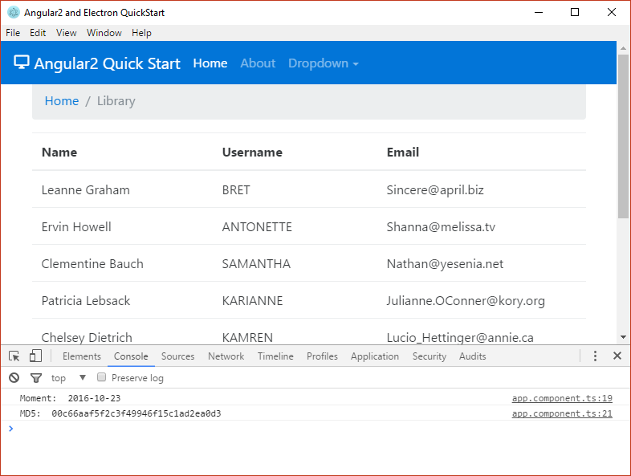

# Basic Angular2 + Electron + Systemjs

## Installation

`$ git clone https://github.com/siteslave/angular2-electron-systemjs`

`$ cd angular2-electron-systemjs`

`$ npm install`

`$ typings install`

## Running

`$ npm start`

`$ electron .`

## Screenshot

